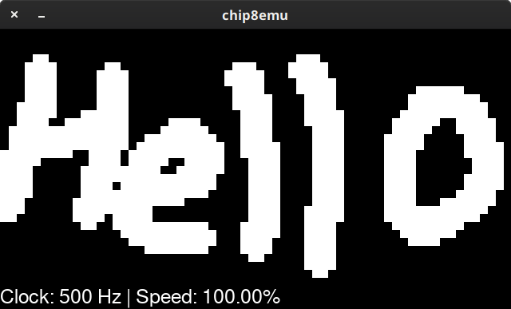
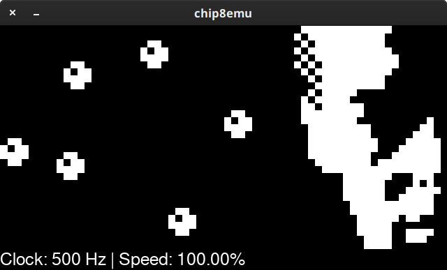
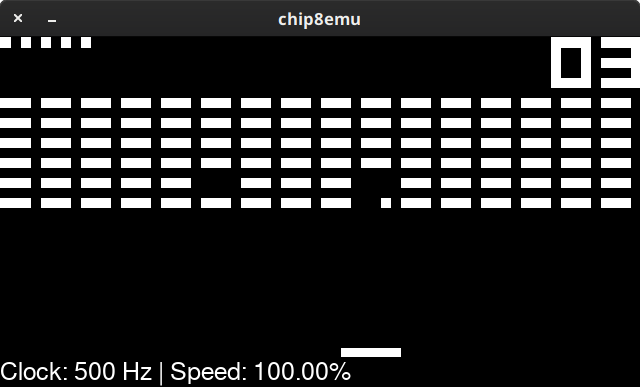
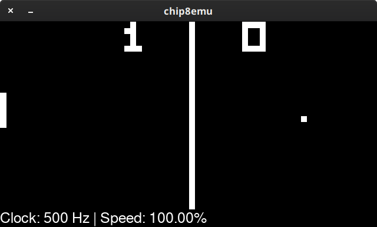

# **chip8emu** — yet another CHIP-8 interpreter

This is a basic CHIP-8 emulator written in C in a few days.
It uses SDL2 for input and output, but in theory can be used with other libraries since main code is made to be library-independent.
Requirements: C compiler, SDL2, SDL2_Mixer and SDL2_ttf.

Interpreter supports workarounds for instructions 8XY6, 8XYE, 8X55 and 8X65.
These are required for some games and programs such as Merlin, Keypad test program, and BC Test ROM by BestCoder.

**Usage**: ./chip8emu *\<romfile\>* *\<workaround flag\>*

### Features
- The default speed is 500 Hz, or 500 cycles per clock.
- You can increase the speed by 10 Hz during execution by pressing **]** and decrease it by pressing **[**
- To enable workarounds, just pass "1" after ROM path (see usage).
- You can reset the emulator during program execution at any time by pressing **P**

###Key mapping
|   1   |   2   |   3   |   C   |   →   |   1   |   2   |   3   |   4   |
| :---: | :---: | :---: | :---: | :---: | :---: | :---: | :---: | :---: |
| **4** | **5** | **6** | **D** |   →   | **Q** | **W** | **E** | **R** |
| **7** | **8** | **9** | **E** |   →   | **A** | **S** | **D** | **F** |
| **A** | **0** | **B** | **F** |   →   | **Z** | **X** | **C** | **V** |

##Screenshots

 
 
 